# one-shots

Все ваншоты где-то хостятся, тут они так, для коллекции и референса

## Сигналы

Складывание разных форм сигналов

* дельта-функция
* квадратный
* асимметричный (логнорм с mu=0, sigma=0.5)
* затухающий быстро (e^-x)
* затухающий помедленнее (e^-0.5x)

Один сигнал "догоняет" второй. А когда вся сумма пересекает красную черту, график аж трясёт

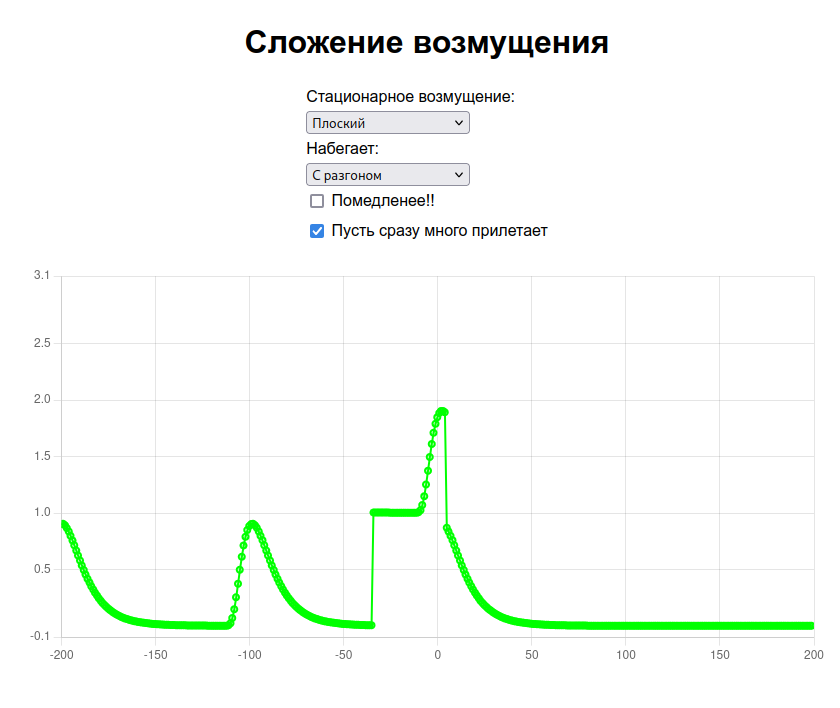

## Задача убегания

Хищник бежит за жертвой в замкнутом квадратике канваса, жертва бежит разными способами:

* по синусоиде
* по кругу
* по расходящейся спирали

Можно телепортнуть обоих, можно добавить жизни хищнику, ~можно грабить корованы,~ можно регулировать скорости 

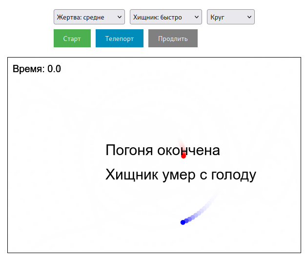

## Интерференция волн

Тыкаешь в большой канвас &mdash; видишь как волны плещутся и складываются. Немного укачивает.

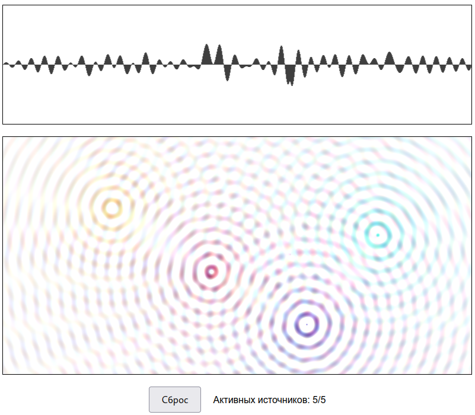

## Интерполяция

Когда слишком много точек, получается чертовщина. Можно поставить точки и выбрать чертовщину на вкус!

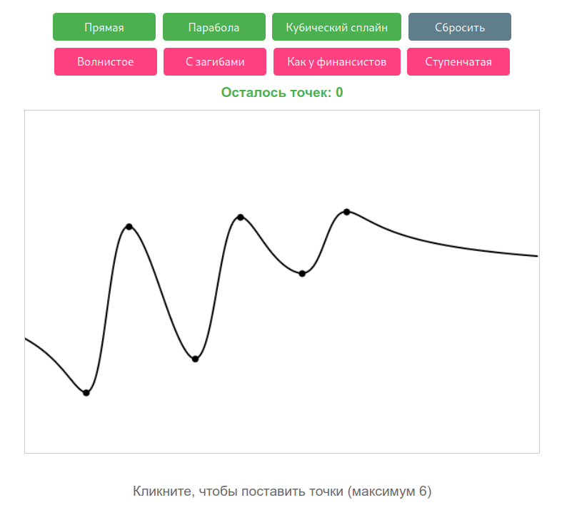

## Проводим линию, параболу или кубоиду через точки с весами

Интерполяция попроще, чертовщины поменьше, можно делать точки с весами и заставлять проходить через них кривую йее 🕺🏻

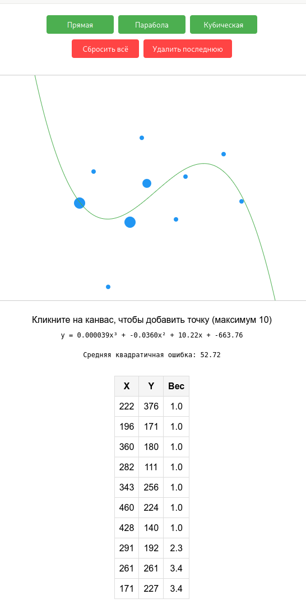

## Ретроградный Меркурий

Визуализация в виде шариков и кружочков о популярном меме.

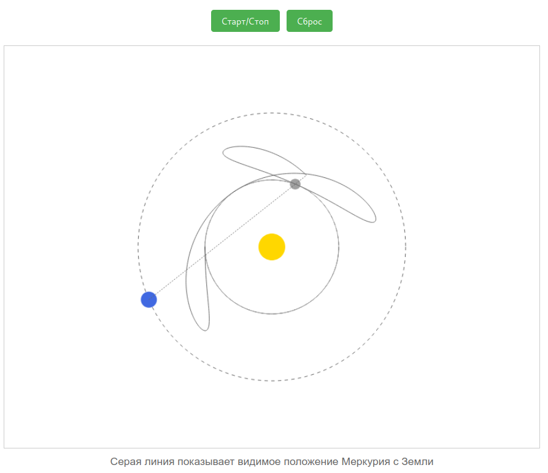

## Вертикальные линии

В тему [genuary2025/1](https://genuary.art/prompts#jan1)

В чём проблема? Взял kernel, уверенно взял картинку за руку и свёртку _херак!_

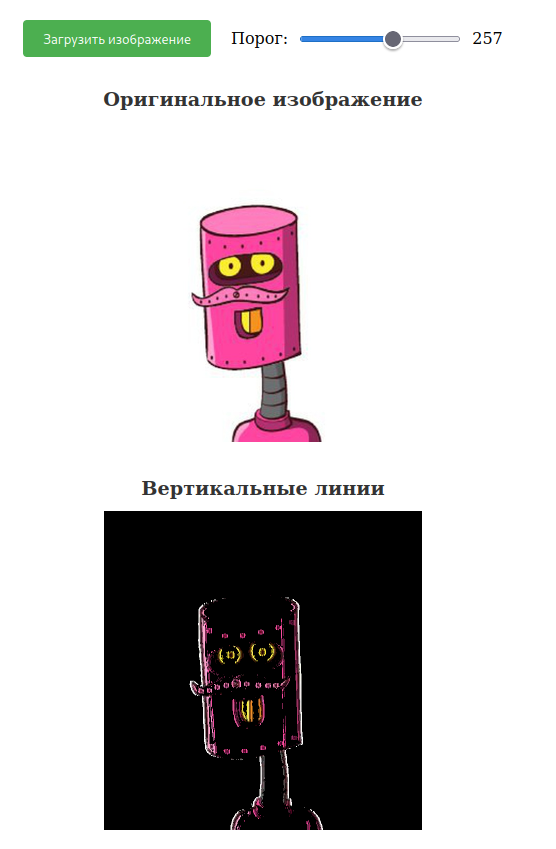

## Муары

В тему [genuary2025/2](https://genuary.art/prompts#jan2)

Всегда нравились муары, тут можно сделать их самому себе. Довольно залипательно!

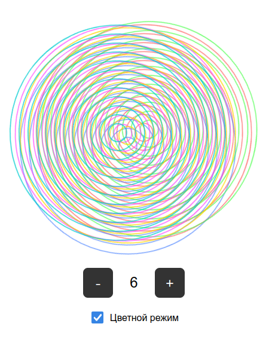

## Ленточки в 42 строки кода на js

В тему [genuary2025/3](https://genuary.art/prompts#jan3)

Нечитаемый код, но красивое. Получился какой-то логотип дельфийских игр будто бы. Ленточки следуют за мышкой или пальцем

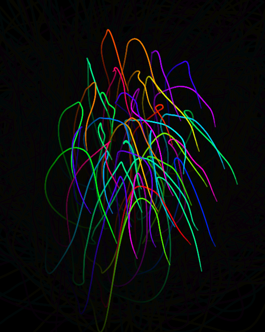

## Чёрные волны на чёрном фоне

В тему [genuary2025/4](https://genuary.art/prompts#jan4)

Если двигать пальцем по экрану влево-вправо или вверх-вниз, то что-то будет меняться.

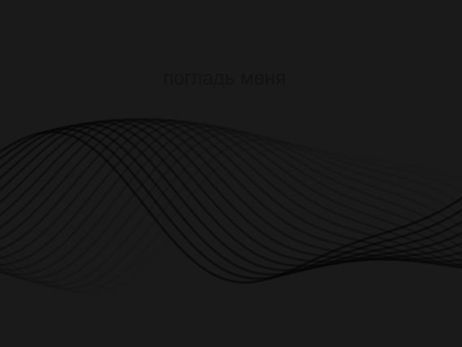

## Изометрическая игра &laquo;жизнь&raquo;

В тему [genuary2025/5](https://genuary.art/prompts#jan5)

То же самое что и обычная игра жизнь, только взгляд "сбоку". Неожиданно сложно оказалось понять в каком порядке рисовать квадратики чтобы они не мешались друг другу, но я доволен результатом.

Новые клетки в этой итерации красятся зелёным, а старые &mdash; чёрные.

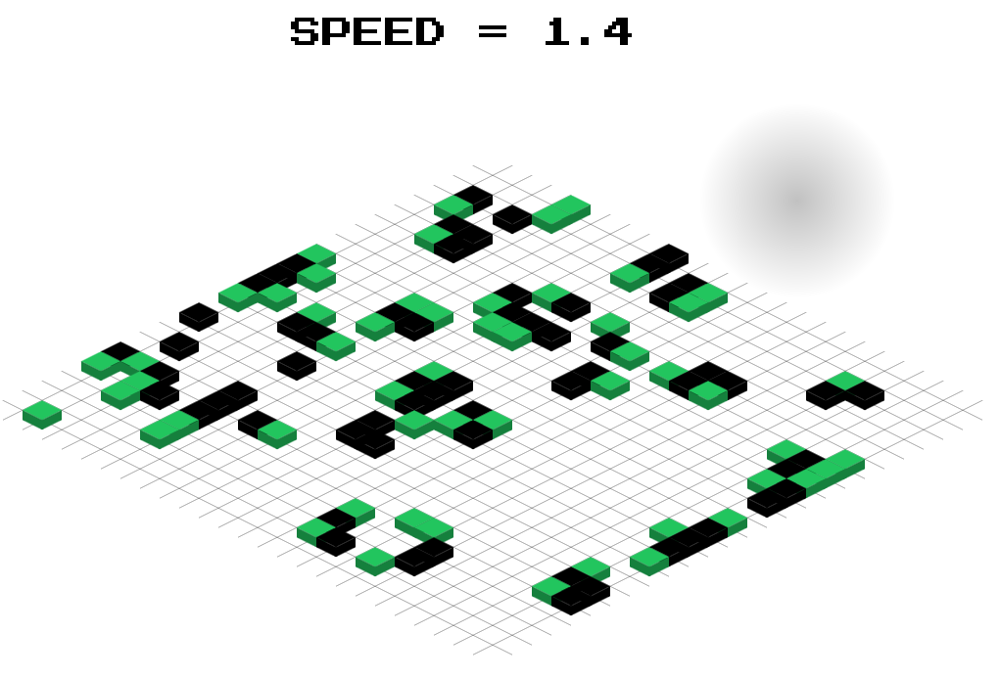

## Пейзаж из примитивных форм

В тему [genuary2025/6](https://genuary.art/prompts#jan6)

Только примитивные формы, но зато можно подвигать солнышко

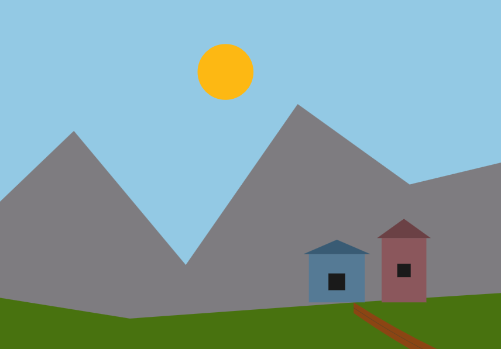

## Непростые простые числа на комплексной плоскости

Прикольная штука, что то что то:

* [Гауссовы простые](https://ru.wikipedia.org/wiki/%D0%93%D0%B0%D1%83%D1%81%D1%81%D0%BE%D0%B2%D1%8B_%D1%86%D0%B5%D0%BB%D1%8B%D0%B5_%D1%87%D0%B8%D1%81%D0%BB%D0%B0#%D0%9F%D1%80%D0%BE%D1%81%D1%82%D1%8B%D0%B5_%D0%B3%D0%B0%D1%83%D1%81%D1%81%D0%BE%D0%B2%D1%8B_%D1%87%D0%B8%D1%81%D0%BB%D0%B0) &mdash; прикольная надстройка над обычными простыми, причём такая что если обычное число простое то не факт что оно будет простым гауссовым 🤯
* [Простые числа Эйзештейна](https://ru.wikipedia.org/wiki/%D0%A7%D0%B8%D1%81%D0%BB%D0%BE_%D0%AD%D0%B9%D0%B7%D0%B5%D0%BD%D1%88%D1%82%D0%B5%D0%B9%D0%BD%D0%B0#%D0%9F%D1%80%D0%BE%D1%81%D1%82%D1%8B%D0%B5_%D1%87%D0%B8%D1%81%D0%BB%D0%B0_%D0%AD%D0%B9%D0%B7%D0%B5%D0%BD%D1%88%D1%82%D0%B5%D0%B9%D0%BD%D0%B0) &mdash; эти просто прикольные потому что hexagons are the bestagons

Anyway, можно посмотреть на одно, можно на сразу оба

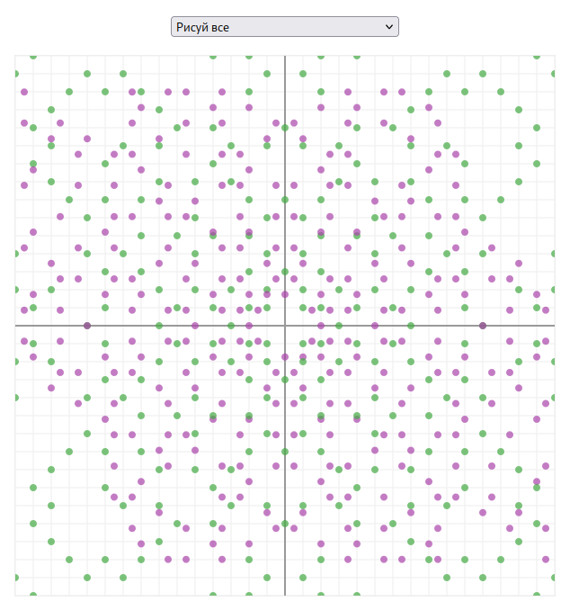

## Кружочки, формирующиеся в фигуры

Вдохновлялся тут задачкой из AdventOfCode 2024 где надо было найти ёлочку. Memo to self: шум перлина не то чтобы сильно даёт в движении частиц в подобных визуализациях. 

В тему [genuary2025/14](https://genuary.art/prompts#jan14) &mdash; никаких серостей, только белое и чёрное. Клик меняет немного направление движения всех частиц.

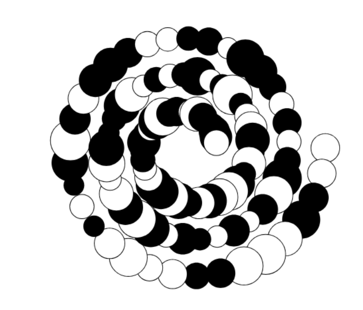

## Овцы жрут траву

Овцы жрут траву, разможноаются (делением), трава может снова вырасти. Можно управлять некоторыми настройками.

Прикольно параметрами ловить пульсацию, кажется это как в модели Лотки-Вольтерра 🤔

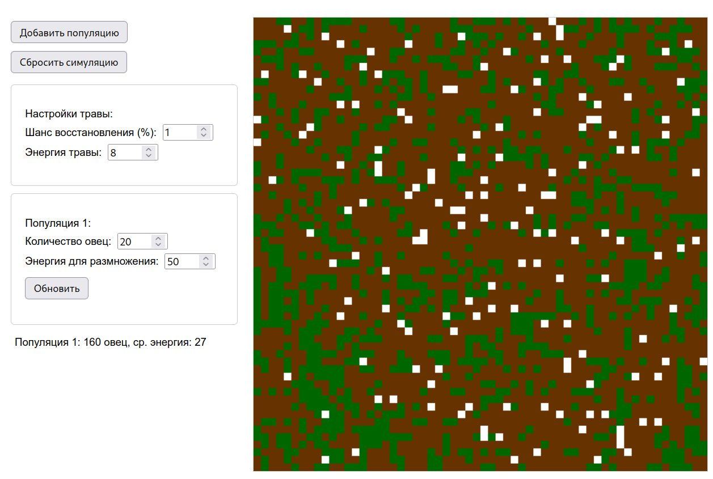

## Цветочек

Куча крутилок чтобы сделать цветочек 🌺. Все параметры в GET запросе, поэтому им ещё и можно делиться!

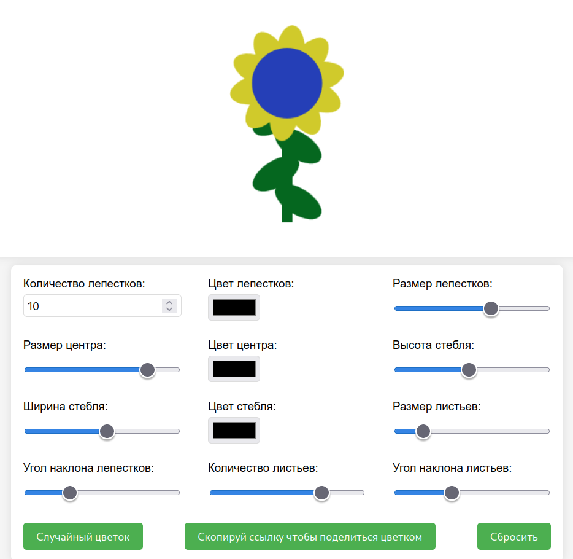

## Рыбки

Зарисовка про Boids и алгоритмы поведения косяка. Немного поверхностно, потому что не хотелось перегружать кучей контролов

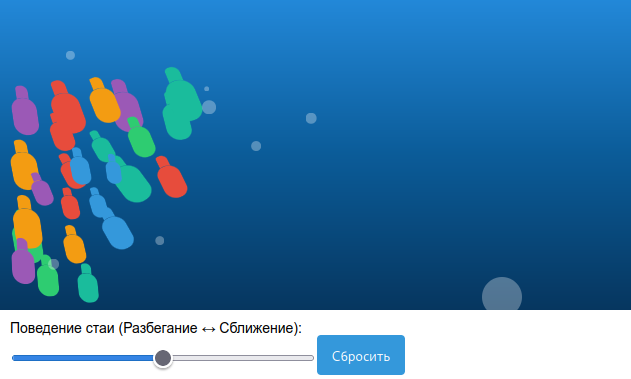

## Полиритм 3:2

Визуализация полиритма "3 через 2". Тут упоролся по контролам немного, но зато есть звук!

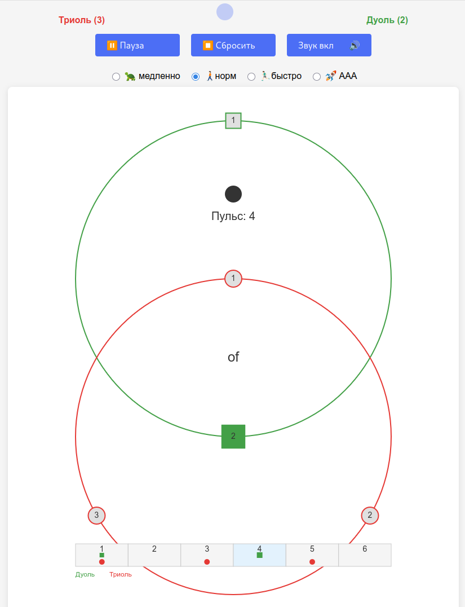

## Полиритм 4:3

Визуализация полиритма "4 через 3". Ну понятно, захотелось дальше развить тему, тут уже пульс сильно мешал поэтому его пришлось приглушить и добавить чекбокс выключения.

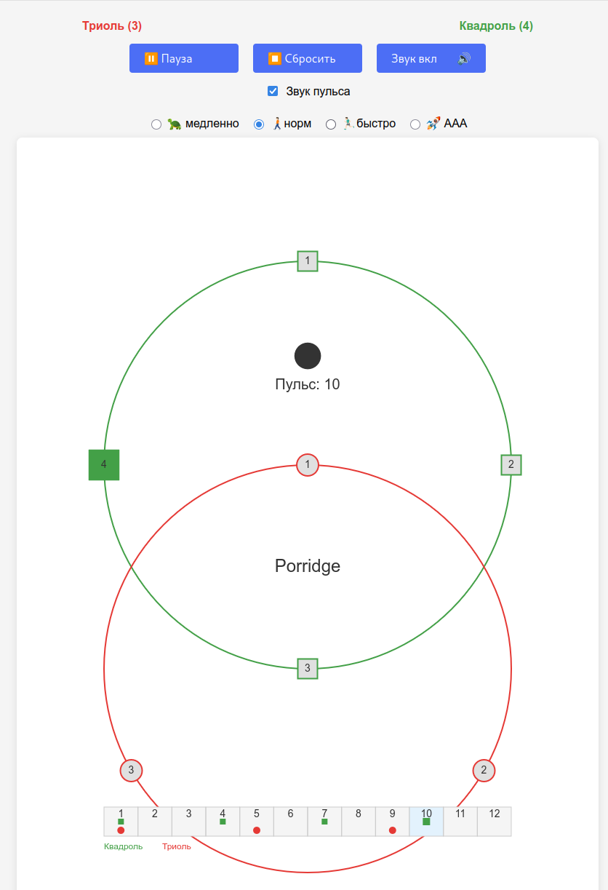

## Линейный осциллятор

Грузик на пружинке и его фазовый портрет

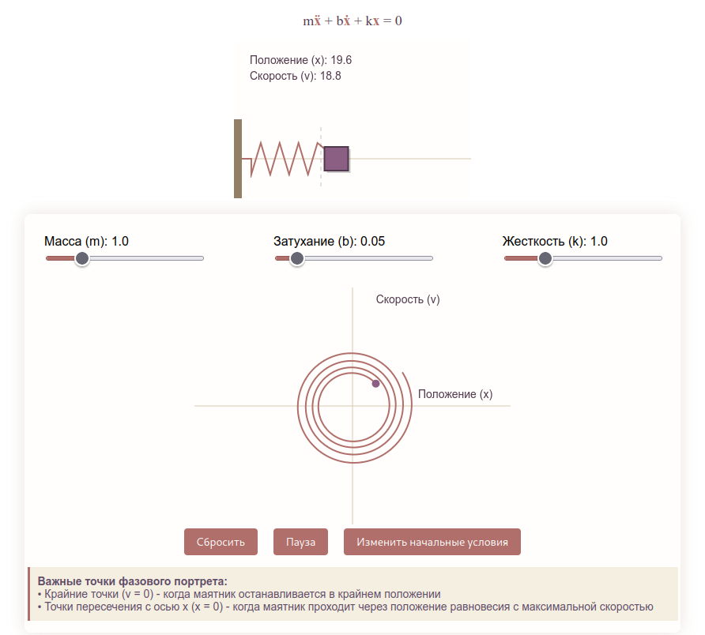

## Уравнение Циолковского

График и два ползунка о тирании ракетного уравнения

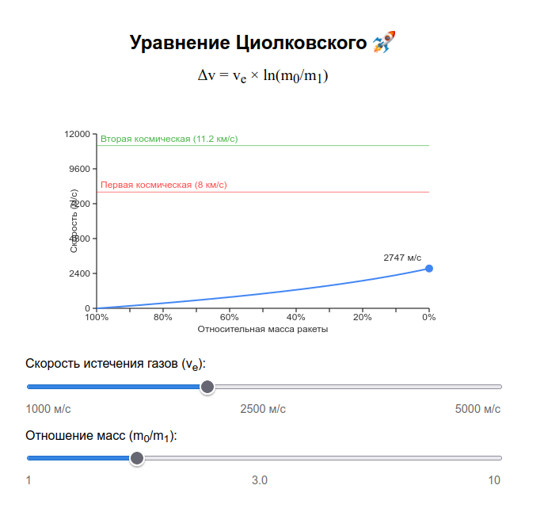

## Частицы и силы Ван дер Ваальса

Частицы, взаимодействующие по принципу "френдзоны" и отталкиваются когда они слишком близко, но притягиваются когда они не слишком далеко. Можно двигать пальцем чтобы поменять силу и энергию в системе.

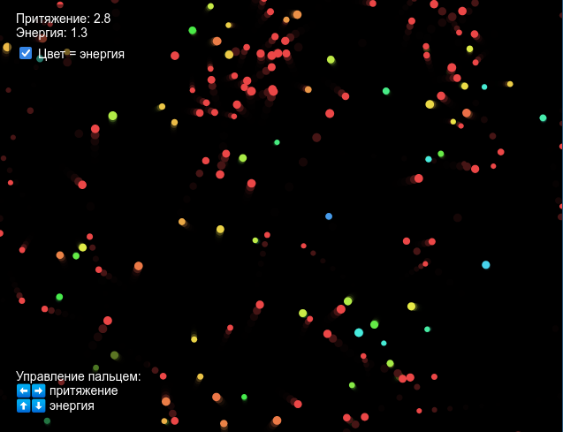

## Обратные квадраты

Обратные квадраты притягивающие точки к центрам притяжения

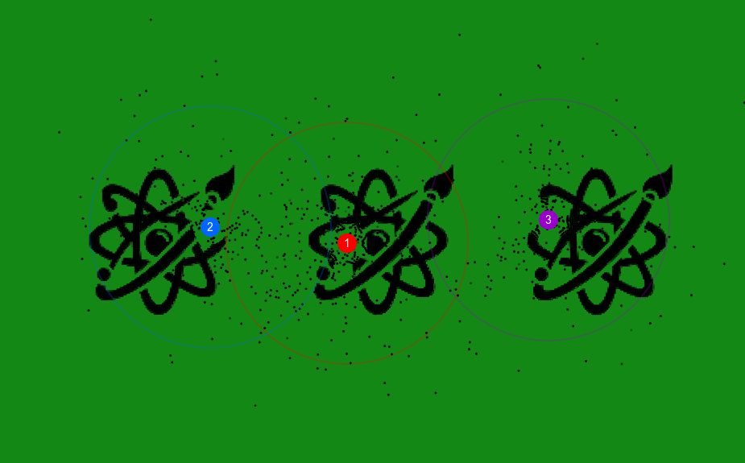
